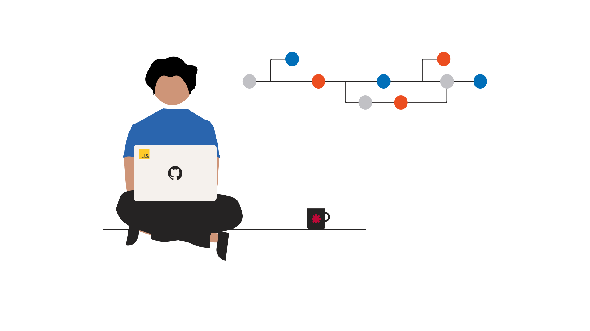

<h1 align="center">Hi 👋, I'm DevDuque</h1>
<h3 align="center">A developer in development</h3>

<h4 align="center">  </h4>

- 🌱 I’m currently learning **Full Stack Development**

- 💬 Ask me about **Everything**

- 💼 How to reach me **devgduque@gmail.com**

- ⚡ Fun fact **The first computer “bug” was an actual real-life bug** 

<h3 align="left">Connect with me:</h3>

<h3 align="left">Languages:</h3>

<h4> Front End:</h4>

    
<h4> Back End:</h4>

    
<h3 align="left">Tools:</h3>

    
<h3 align="left">Operating System:</h3>

&nbsp;

